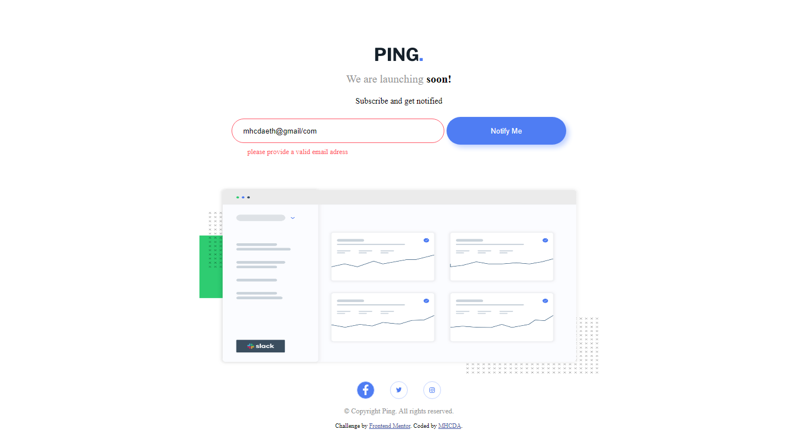

# Frontend Mentor - Ping coming soon page solution

This is a solution to the [Ping coming soon page challenge on Frontend Mentor](https://www.frontendmentor.io/challenges/ping-single-column-coming-soon-page-5cadd051fec04111f7b848da). Frontend Mentor challenges help you improve your coding skills by building realistic projects. 

## Table of contents

- [Overview](#overview)
  - [The challenge](#the-challenge)
  - [Screenshot](#screenshot)
- [My process](#my-process)
  - [Built with](#built-with)
  - [Useful resources](#useful-resources)
- [Author](#author)

## Overview

  -in this challenge i belive in ive made as much as possible i understand to be built but ive made one update on the input error section and since programming is a part of fixing problems ive made some other way of on desktop version social media icons hover property, ive made a copy of the svg icons with a white fill color and change to whie icon while the mouse hover in the section and back to where it was on mouse leave.

  - and in this and my previous js challanges was i trying to make the page referesh the icons state while the screen width change but am unable to accomplish that so if anyone can halp me to let me know how can i accomplish that i'll be so gald to take a note on that

### The challenge

Users should be able to:

- View the optimal layout for the site depending on their device's screen size
- See hover states for all interactive elements on the page
- Submit their email address using an `input` field
- Receive an error message when the `form` is submitted if:
	- The `input` field is empty. The message for this error should say *"Whoops! It looks like you forgot to add your email"*
	- The email address is not formatted correctly (i.e. a correct email address should have this structure: `name@host.tld`). The message for this error should say *"Please provide a valid email address"*

### Screenshot

## My process

- first i bulit it with mobile first and then desktop after all of that the js functionality

### Built with

- Semantic HTML5 markup
- CSS custom properties
- Flexbox
- CSS Grid
- Mobile-first workflow
- Js

### Useful resources

- [w3schools](https://www.w3schools.com) - Best referance for every html css and js codes
- [mdn webdocs](https://www.mdn.com) - Best for more detial explaination on every css js html properties or more in my openion

## Author

- MHCDA WEB - [Personal Website](https://l.instagram.com/?u=https%3A%2F%2Fmhcdaeth.github.io%2Fmhcda-eth-web-v2.0%2F&e=ATPAww3rFG5eut5TBkT5JUcz9pju1Or8E1VaQyVT1fWS6D3_cLLe5tsUEGmN_pBT1FEnFj8wRmuSvyAWc19S7hA&s=1)
- Frontend Mentor - [@mhcdaeth](https://www.frontendmentor.io/profile/mhcdaeth)
- Twitter - [@MhcdaE](https://twitter.com/MhcdaE/)